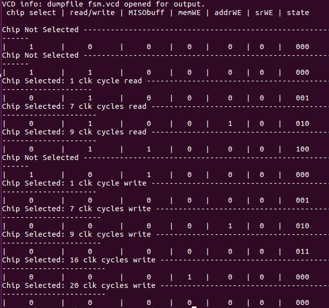
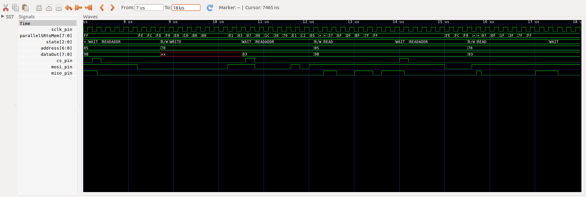

## Lab 2 Writeup
Rocco, Judy, Chris

### Testing

#### Shift Register
To test the shift register, we just wrote a test script to cycle the clock and change the inputs, then looked at the output to make sure it was shifting correctly. We also uploaded it to the FPGA and tested a number of cases there.

#### State Machine
For the state machine, we wrote a script with a clock, then set the chip select pin and checked the state and enable outputs after a set number of clock cycles. This was mostly based on our logic about how the rest of the system would work, so we wanted to look at the output instead of trying to write a test which would output a pass or fail. Testing this before putting everything together helped with both our confidence in the system and with our logic about how the parts needed to connect. The final test of the state machine is shown below.

The states are maped: 000:Wait, 001:ReadAddress, 010:ReadOrWrite, 011:Write, 100:Read, 0 is a write opperation.

No flags are set until the end of the ReadAddress state (in the 7th clock cycle), at which point addrWE is set. For a read opperation, srWE is set momentarily (not shown), then MISObuf si set for the duration of the read. For a write opperation, nothing is set while the shift register is filled again, then memWE is set after the last value is recieved.

#### SPI memory
To test the memory, we did three tests. The first was to write to an address in memory and read the value back. The second was to write to a second address and read back the values from both addresses, and the third was to deselect the device, write to the first memory address again, and read back to make sure the value hadn't changed. This test prints messages if the tests fail, or just "all tests passed" if none fail.

### Waveforms

The waveform from the SPI test for writing to the second memory address, then reading back from the first and second address, is shown below:

The top trace is the spi clock, followed by the value in the shift register, the state (from the state machine), the memory address from the memory block, dataOut of the memory block, chip select, MOSI, and MISO. The first action is a write action, where the value 3 is written to address 78. Next, we read the value from address 5 (value is 9B), and finally, we read back the value from address 78.
